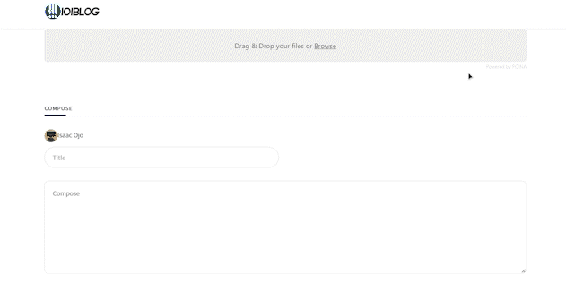

# Blog(Full Stack) - MongoDB + Express + React + Node.js

## Home Page

## Compose Page

## Completion

About 60% Completed

- [x] Login With Google
- [x] Create Blog Post with Images
- [x] View BlogPost
- [x] View Individual Author Blog Post
- [x] Beautiful UI
- [x] MutiPage

## Todo

- [] Refractor Code
- [] Add User Page + Other
- [] Clean Up code

## Stack

MERN - Mono DB + Express + React + Node.Js

## How to RUN Locally

1. git clone directory
2. npm run install
3. Create the .env File with the following content:
MONGO_URI=your_mongo_uri
TOKENFORBLOG= RANDOM STRINGS OF CHARACTERS // This is the token you will use to post a blog {it makes sure that only you can post a blog}
4. npm run start-backend && npm run start-client.

## How to Deploy ?

1. cd into client and npm run build:staging
2. copy contents of build folder to public in root directory.
